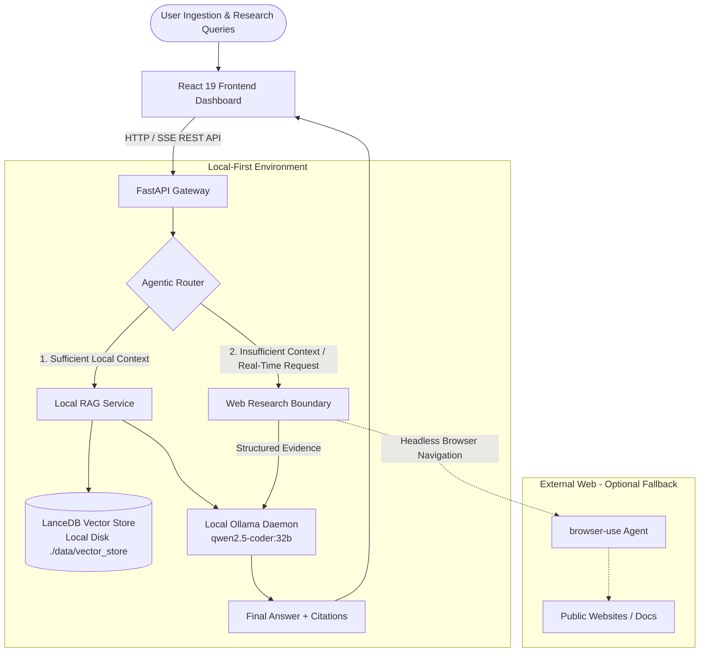

# Local Research Agent

> A local-first research workspace for private documents, Ollama inference, and optional bounded web research.

[](https://www.python.org/)
[](LICENSE)

---

## 1. Project Overview

**Local Research Agent** is an open-source research companion. It stores uploaded source documents and LanceDB vectors locally, and sends prompts to a local Ollama daemon for embeddings and synthesis.

The agent ingests your local documents (PDF, Markdown, text), constructs an embedded local vector database using **LanceDB**, and answers complex research inquiries using an on-device Large Language Model served via **Ollama** (such as `qwen2.5-coder:32b` or `llama3.3:70b`).

When a query cannot be answered from local material—or explicitly needs fresh information—the router can use a time- and step-bounded `browser-use` run. That option sends the research task to external public websites and is not private.

---

## 2. Core Features

- **Local Document Ingestion**: PDF, Markdown, and text extraction, bounded chunking, Ollama embeddings, and persistent LanceDB indexing.
- **Local RAG (Retrieval-Augmented Generation)**: Fast vector search with LanceDB disk-backed columnar storage, zero external database setup.
- **Local LLM Inference via Ollama**: Runs entirely on-device; compatible with `qwen2.5-coder:32b`, `llama3.3:70b`, `mistral`, and custom quantized models.
- **Intelligent Agentic Routing**: Heuristic and similarity-based routing evaluating context sufficiency before deciding whether to invoke external browsing.
- **Bounded Web Research**: `browser-use` has configurable time and step limits; it does not use credentials or submit forms.
- **Execution Log**: Inspect observable router, retrieval, browser, and synthesis events after a response completes.
- **Local-first Privacy**: Documents, vectors, and Ollama prompts stay local unless web research is selected.
- **Docker & uv Ready**: Fast multi-stage Docker builds with host Ollama connectivity out of the box.
- **Extensible Provider Architecture**: Decoupled protocols for VectorStore, LLM, RAG, and Web Research allowing effortless model or database swapping.

---

## 3. Architecture



---

## 4. Data Flow

```text
               User Query
                   │
                   ▼
             Agent Router
                   │
                   ▼
         Local Vector Retrieval
                   │
         Is context sufficient?
         ├── YES ─────────────────────────────┐
         │                                    │
         └── NO (or Temporal Cues)            ▼
                   │                  Local Ollama LLM
                   ▼                          ▲
         browser-use Web Agent                │
                   │                          │
                   ▼                          │
             Web Evidence ────────────────────┘
                                              │
                                              ▼
                                     Synthesized Response
                                   + Source Citations
                                   + Agent Execution Log
```

---

## 5. Repository Structure

```text
local-research-agent/
├── backend/
│   ├── app/
│   │   ├── __init__.py
│   │   ├── main.py                  # FastAPI application entry point & lifespan
│   │   ├── api/
│   │   │   ├── __init__.py
│   │   │   └── routes/
│   │   │       ├── __init__.py
│   │   │       ├── health.py        # Health & component telemetry endpoint
│   │   │       ├── documents.py     # Document upload & listing with security bounds
│   │   │       └── chat.py          # End-to-end research chat endpoint
│   │   ├── core/
│   │   │   ├── __init__.py
│   │   │   ├── config.py            # Strongly-typed pydantic-settings
│   │   │   ├── logging.py           # Structured logging configuration
│   │   │   └── exceptions.py        # Domain exception hierarchy
│   │   ├── dependencies/
│   │   │   ├── __init__.py
│   │   │   └── database.py          # Dependency injection for VectorStore
│   │   ├── models/
│   │   │   ├── __init__.py
│   │   │   └── schemas.py           # Pydantic schemas for requests, responses & events
│   │   ├── services/
│   │   │   ├── __init__.py
│   │   │   ├── llm.py               # BaseLLMService & OllamaLLMService
│   │   │   ├── rag.py               # BaseRAGService & LocalRAGService
│   │   │   └── web_research.py      # BaseWebResearchService & WebResearchService
│   │   ├── agent/
│   │   │   ├── __init__.py
│   │   │   ├── router.py            # AgentRouter (Local vs Web decision engine)
│   │   │   └── browser.py           # BrowserAgentService isolating browser-use
│   │   └── storage/
│   │       ├── __init__.py
│   │       └── vector_store.py      # BaseVectorStore & LanceDBVectorStore
│   ├── tests/
│   │   ├── __init__.py
│   │   └── test_health.py           # Pytest health suite
│   ├── pyproject.toml               # Python 3.12+ project & uv specification
│   └── .env.example                 # Backend environment variable template
│
├── frontend/
│   ├── src/
│   │   ├── components/
│   │   │   ├── Header.tsx           # Status bar with Ollama/LanceDB/Privacy badges
│   │   │   ├── DocumentSidebar.tsx  # Drag-and-drop document upload & list
│   │   │   ├── ChatInterface.tsx    # Research chat with citations & prompts
│   │   │   ├── AgentExecutionLog.tsx# Collapsible agent telemetry accordion
│   │   │   └── SettingsModal.tsx    # System architecture & privacy details
│   │   ├── lib/
│   │   │   └── api.ts               # Typed API client with offline fallback
│   │   ├── types/
│   │   │   └── api.ts               # TypeScript interfaces matching backend models
│   │   ├── App.tsx                  # Root frontend component
│   │   ├── main.tsx                 # React DOM mount point
│   │   └── index.css                # Tailwind CSS v4 styling
│   ├── package.json                 # React 19 + Vite dependencies
│   ├── vite.config.ts               # Vite configuration
│   ├── tsconfig.json                # TypeScript strict configuration
│   └── .env.example                 # Frontend environment template
│
├── docker/
│   ├── backend.Dockerfile           # Multi-stage uv builder & runtime
│   └── frontend.Dockerfile          # Multi-stage Node builder & Nginx runtime
│
├── data/
│   ├── documents/                   # Private uploaded PDF/Markdown files (.gitkeep)
│   ├── vector_store/                # LanceDB columnar vector tables (.gitkeep)
│   └── cache/                       # Agent scratchpad & cache (.gitkeep)
│
├── docker-compose.yml               # Multi-container composition with host Ollama bridge
├── .gitignore                       # Production gitignore
├── .dockerignore                     # Docker build exclusions
├── LICENSE                          # MIT License
└── README.md                        # Documentation
```

---

## 6. Requirements

- **Python**: 3.12 or higher
- **Node.js**: 20.x or higher
- **Package Managers**:
  - `uv` (recommended for Python backend)
  - `npm` or `pnpm` (for frontend)
- **Ollama**: Installed locally on the host machine
- **Docker & Docker Compose**: (Optional, for containerized execution)

---

## 7. Ollama Setup

1. Install Ollama from [ollama.com](https://ollama.com).
2. Start the Ollama background daemon:
   ```bash
   ollama serve
   ```
3. Pull the target model and embedding model:
   ```bash
   # Main reasoning & coding LLM
   ollama pull qwen2.5-coder:32b

   # Embedding model for local vector RAG
   ollama pull nomic-embed-text
   ```
   *(Note: You can also use other models such as `llama3.3:70b`, `qwen2.5:14b`, or `mistral` by editing `OLLAMA_MODEL` in your `.env` file.)*

---

## 8. Local Development

### Backend Setup

```bash
# 1. Navigate to backend directory
cd backend

# 2. Sync virtual environment with uv
uv sync

# 3. Create your local .env configuration
cp .env.example .env

# 4. Start the FastAPI development server
uv run uvicorn app.main:app --host 0.0.0.0 --port 8000 --reload
```

The API will be accessible at `http://localhost:8000`. Interactive documentation is available at `http://localhost:8000/docs`.

### Frontend Setup

```bash
# 1. Navigate to frontend directory
cd frontend

# 2. Install dependencies
npm install

# 3. Start Vite dev server
npm run dev
```

The React dashboard will be running at `http://localhost:3000`.

---

## 9. Docker Development

To run both services using Docker Compose while connecting to the Ollama daemon running on your host machine:

```bash
docker compose up --build
```

### Host Ollama Networking Note
The `docker-compose.yml` configures `host.docker.internal:host-gateway` and points `OLLAMA_BASE_URL=http://host.docker.internal:11434`. This ensures the containerized backend reaches your host machine's Ollama instance without bundling massive weights inside Docker images.

---

## 10. Privacy Model

| Data Element | Storage Location | Leaves Local Device? |
| :--- | :--- | :--- |
| **User Documents (PDF/Markdown)** | `./data/documents` | **Never** |
| **Vector Embeddings & Chunks** | `./data/vector_store` (LanceDB) | **Never** |
| **User Inquiries & Prompts** | Memory / Local Logs | **Never** |
| **LLM Inference** | On-device Ollama Daemon | **Never** |
| **Web Research Fallback Queries** | Public Search Engines & Web Pages | **Only search query keywords** when local context is insufficient |

---

## 11. Architectural Decisions

- **Vector Database**: **LanceDB** was selected over SQLite-vec. LanceDB is a pure serverless, disk-backed columnar vector database with Rust performance, zero background server process, native Apache Arrow integration, and instant cross-platform portability without compilation headaches.
- **Modular Boundaries**: `BrowserAgentService` isolates `browser-use` so the core application never depends directly on browser lifecycle details.
- **Dependency Inversion**: Services (`LLMService`, `RAGService`, `VectorStore`) implement abstract base protocols, making unit testing and future provider swapping seamless.

---

## 12. Current status and roadmap

- [x] Local document upload, extraction, chunking, embedding, persistent indexing, listing, and deletion.
- [x] Deterministic local-vs-web routing and REST response execution telemetry.
- [x] Bounded browser-use adapter using the configured local Ollama model.
- [x] Docker configuration, CI workflow, lint/type-check configuration, and basic deterministic tests.
- [ ] SSE streaming, cancellation, background indexing/retry, stronger browser sandboxing, and frontend component tests.

## 13. API overview

| Endpoint | Purpose |
| --- | --- |
| `GET /health` | Runtime and local dependency status |
| `GET /api/v1/documents` | List the local document catalog |
| `POST /api/v1/documents/upload` | Upload and index a PDF, Markdown, or text document |
| `DELETE /api/v1/documents/{id}` | Delete a document and its vector chunks |
| `POST /api/v1/chat` | Run local RAG, optional web research, and local synthesis |

## 14. Testing

```bash
cd backend
uv sync --extra dev
uv run ruff check .
uv run pytest
uv run mypy app

cd ../frontend
npm ci
npm run build
```

## 15. Screenshots

No screenshots are committed. Maintainers can add redacted screenshots here after confirming no private document content is visible.

## 16. Contributing and license

See [CONTRIBUTING.md](CONTRIBUTING.md), [SECURITY.md](SECURITY.md), and the [MIT License](LICENSE).
# 3-DOORS
# 3-DOORS
